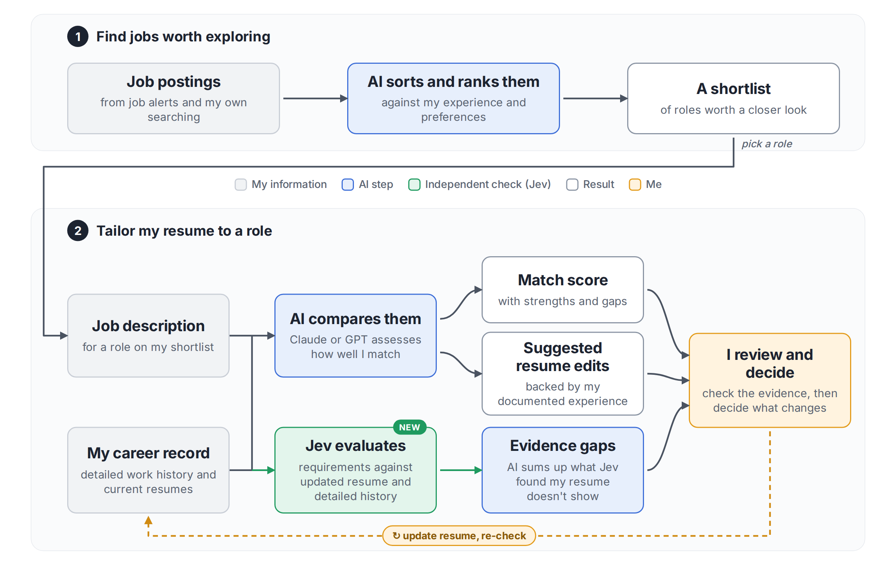

# Jev Role Review

A second opinion for AI-assisted resume tailoring.

When an AI helps tailor a resume to a job, it usually grades its own work too. This project adds an independent check. [Jev](https://typesafe.ai) from TypeSafe AI scores the same job requirements twice: once against my tailored resume, and once against my full career history. When the full history scores higher on a requirement, I have the experience but my resume isn't showing it. I review those gaps and decide what, if anything, to change.



This is a personal, single-user project that I use in my own job search. It's public as a working example of an MCP integration with a clear privacy boundary. The repository only contains synthetic data.

## How it's built

The project has two parts, and both run the same comparison:

- **`skills/jev-assess-role/` (Python):** the original version. It's a portable Agent Skill that Claude Code or Codex runs locally with a small Python script.
- **`server/` (TypeScript):** the hosted version, added later. It's an MCP server so that any MCP-capable assistant (Claude, ChatGPT, Codex) can call the assessment as a tool without local setup. TypeScript was chosen for the official MCP SDK and Cloudflare Workers support.

The code was written with AI coding agents (Claude and Codex). I set the architecture, the security and privacy boundaries, and the test requirements, and I reviewed the output. Fittingly, that's the same idea as the project itself: AI does the work, and something independent checks it.

Each hosted assessment accepts up to 60 questions. The cap limits abuse of the Jev API key and isn't a Jev constraint.

## Using the skill

The canonical skill is in `skills/jev-assess-role/`. Project discovery shims are provided for Claude Code and Codex.

### Trigger

Use a request such as:

> Jev assess this.

Then paste a job description or provide its URL. For the hosted MCP app, upload the private long-form career history to the Worker's profile store using the instructions in `server/README.md`; do not add it to a public repository or ChatGPT project sources. A current resume is optional but recommended.

### Configuration

Set the Jev credential outside source control:

```bash
export JEV_API_KEY="..."
```

Optional overrides:

```bash
export JEV_MODEL="jev-latest"
export JEV_API_URL="https://api.typesafe.ai/v1/systemone"
```

Without a key, the workflow can still generate and validate both request packages using `--dry-run`.

See [SKILLS.md](SKILLS.md) for package layout and compatibility.

## Public-repository data boundary

This repository contains reusable code, schemas, documentation, and explicitly synthetic fixtures only. Never commit candidate profiles, resumes, job descriptions, questionnaires derived from real roles, assessment requests or responses, OAuth tokens, provider configuration, or API keys.

Real candidate data and credentials must remain outside the repository and, for a hosted deployment, must be injected through the hosting provider's secret manager and private storage. Runtime logs must record metadata only—not tool arguments, candidate evidence, job-description text, or Jev response bodies.

Run the public-repository check before every commit:

```bash
python3 scripts/check_public_repo.py
```

GitHub Actions runs the same policy check, a synthetic dry run, unit tests, and secret scanning on every push and pull request.

## MCP server

The TypeScript server in [`server/`](server/) exposes `get_candidate_profile`, `get_candidate_profile_metadata`, and `run_dual_assessment`. Its provider-neutral core is deployed through a Cloudflare adapter using OAuth-protected Streamable HTTP at the stable `/mcp` endpoint, private Cloudflare KV profile storage, and a single allowlisted Google account. Local validation uses only synthetic fixtures:

```bash
cd server
npm ci
npm run check
npm run build
```

See [`server/README.md`](server/README.md) for the architecture and exact Cloudflare, Google OAuth, secret, profile-upload, and Git-deployment setup.

## License

[MIT](LICENSE)
